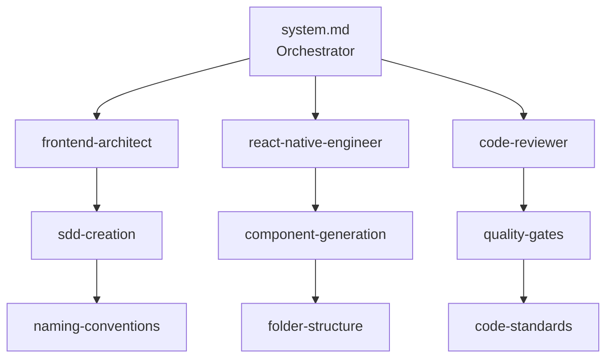

> **[PT]** Registo de melhorias arquiteturais planeadas e tarefas de refatoração futuras para o projeto FUSE.

---

# Future Improvements

> This document tracks planned architectural improvements and refactoring tasks for the FUSE project.

---

## 📊 Progress Overview

**Total Tasks:** 10
**Completed:** 4 ✅
**In Progress:** 0 🚧
**Planned (SDD ready):** 6 📋

> **Tip:** View detailed progress by running: `.ai/scripts/count-improvements-progress.sh`

### Quick Status

- [ ] **Task #1:** Internationalization - Move all free text to translation files — [SDD](./_sdd/task-01-internationalization.md)
- [ ] **Task #2:** Migrate to Tailwind CSS (Uniwind) — [SDD](./_sdd/task-02-tailwind-migration.md)
- [ ] **Task #3:** Offline-First Architecture with SQLite — [SDD](./_sdd/task-03-offline-first-sqlite.md)
- [x] **Task #4:** Update system.md with Complete Agent Orchestration ✅
- [ ] **Task #5:** Code Cleanup and Refactoring — [SDD](./_sdd/task-05-code-cleanup.md)
- [ ] **Task #6:** Agent Orchestration Diagram — [SDD](./_sdd/task-06-orchestration-diagram.md)
- [ ] **Task #7:** English Documentation with Portuguese Headers — [SDD](./_sdd/task-07-english-docs.md)
- [x] **Task #8:** Pre-Push Token Usage Tracking ✅
- [x] **Task #9:** Sonar Auto-Fix Agent ✅
- [x] **Task #10:** Coupling Analysis Agent ✅

---

## 1. Internationalization - Move all free text to translation files

**Status:** Not Started  
**Priority:** High

### Description

All hardcoded text strings throughout the app must be moved to the localization files (`pt.json` and `en.json`). No free text should exist directly in components or screens.

### Why

- [ ] Ensures full i18n support
- [ ] Maintains consistency across translations
- [ ] Simplifies future language additions
- [ ] Follows project standards for maintainability

### Scope

- [ ] Scan all `.tsx` files for hardcoded strings
- [ ] Extract to appropriate translation keys
- [ ] Update components to use `t()` function
- [ ] Verify both PT and EN translations are complete

---

## 2. Migrate to Tailwind CSS (Uniwind)

**Status:** Not Started  
**Priority:** Medium

### Description

Convert the entire app's styling system from current approach to Tailwind CSS using [uniwind.dev](https://uniwind.dev/). All UI components must maintain identical visual appearance.

### Why

- [ ] Unified styling system across the project
- [ ] Better developer experience
- [ ] Reduced style duplication
- [ ] Type-safe styling with Tailwind

### Requirements

- [ ] Configure uniwind.dev for React Native
- [ ] Convert all inline styles and StyleSheet to Tailwind classes
- [ ] Ensure pixel-perfect matching with original designs
- [ ] Update design system constants to work with Tailwind
- [ ] Test all screens and components for visual consistency

---

## 3. Offline-First Architecture with SQLite

**Status:** Not Started  
**Priority:** High

### Description

Implement offline-first architecture where SQLite is the single source of truth. The app always reads from local SQLite database, which is synced with server data on screen entry.

### Why

- [ ] Better user experience (works offline)
- [ ] Faster app performance (local reads)
- [ ] Resilient to network failures
- [ ] Automatic data persistence

### Architecture

```
User Action → Read from SQLite (always)
             ↓
Screen Entry → Fetch from API → Update SQLite
             ↓
On Error → Continue with last session SQLite data
```

### Implementation

- [ ] Setup SQLite schema for all entities
- [ ] Create sync layer that updates SQLite from API responses
- [ ] Implement offline queue for pending mutations
- [ ] Add sync indicators in UI
- [ ] Handle conflict resolution strategies

---

## 4. Update system.md with Complete Agent Orchestration ✅

**Status:** ✅ **Completed**  
**Priority:** Medium

### Description

Update [system.md](../system.md) to document the complete agent orchestration system, including:

- How agents are organized and coordinated
- Which agents have access to which skills
- How skills map to rules
- Agent invocation patterns and workflows

### Implementation

- ✅ Updated [.ai/system.md](.ai/system.md) with complete orchestration system
- ✅ Added Request → Agent Routing Matrix
- ✅ Created delegation workflow documentation
- ✅ Defined agent creation protocol
- ✅ Added request classification rules
- ✅ Created practical orchestration examples
- ✅ Documented multi-agent coordination flows
- ✅ Added orchestration checklist
- ✅ Created [orchestrator-quick-reference.md](.ai/docs/orchestrator-quick-reference.md)
- ✅ Created orchestration metrics tracking (`.ai/router/orchestration.csv`)
- ✅ Created [show-orchestration-stats.sh](.ai/scripts/show-orchestration-stats.sh) script

### Key Features

**Intelligent Routing:**

- System analyzes requests and routes to appropriate agents
- Request type classification (feature, commit, test, review, etc.)
- Automatic agent selection based on keywords and patterns
- Creates new agents when none exists for recurring patterns

**Agent Coordination:**

- Multi-agent workflows (architect → engineer → tester → reviewer)
- Agent-to-agent communication patterns
- Validation after each agent execution

**Git Operation Handling:**

- Direct handling by system (no agent delegation)
- Mandatory quality gate validation
- Explicit user confirmation required
- Never auto-push

**Dynamic Agent Creation:**

- Protocol for creating agents on-demand
- Automatic skill and rule creation
- Documentation updates (system.md, README)
- Logging and metrics

**Practical Examples:**

- Feature development flow
- Commit handling
- Performance analysis
- Sonar fixes
- Coupling analysis
- Unknown task handling (creates new agent)

### Structure

```
system.md (orchestrator)
├── Request Analysis & Routing Matrix
├── Delegation Workflow (3 steps)
├── Agent Creation Protocol (5 steps)
├── Request Classification Logic
├── Orchestration Examples
├── Agent Coordination Flows
└── Orchestration Checklist

Supporting Files:
├── .ai/docs/orchestrator-quick-reference.md (decision tree & commands)
├── .ai/router/orchestration.csv (metrics tracking)
└── .ai/scripts/show-orchestration-stats.sh (statistics viewer)
```

### Usage Examples

**1. System Routes to Agent:**

```
User: "Create a notification center"
System: Analyzes → Routes to frontend-architect → Creates SDD
        → Routes to react-native-engineer → Implements
        → Routes to test-writer → Adds tests
        → Routes to code-reviewer → Validates
        → Asks user to confirm commit
```

**2. System Handles Git Directly:**

```
User: "commit this"
System: SYSTEM_DIRECT (no agent delegation)
        → Validates quality gates
        → Shows staged changes
        → Suggests conventional commit message
        → Requests explicit confirmation
        → Executes commit
        → Never auto-pushes
```

**3. System Creates New Agent:**

```
User: "generate security audit report"
System: No agent found → Creates security-auditor agent
        → Creates security-patterns skill
        → Updates system.md routing
        → Executes new agent
        → Notifies user of new agent
```

### Documentation

- **Main Orchestration:** [.ai/system.md](.ai/system.md)
- **Quick Reference:** [.ai/docs/orchestrator-quick-reference.md](.ai/docs/orchestrator-quick-reference.md)
- **Agent Overview:** [.ai/agents/README.md](.ai/agents/README.md)
- **Routing Logic:** [.ai/router/router.md](.ai/router/router.md)

### Metrics

View orchestration statistics:

```bash
.ai/scripts/show-orchestration-stats.sh 7  # Last 7 days
```

Shows:

- Total requests and success rate
- Request type distribution
- Agent usage frequency
- New agents created
- Average duration

---

## 5. Code Cleanup and Refactoring

**Status:** Not Started  
**Priority:** Medium

### Description

Comprehensive codebase audit to:

- Remove unnecessary configurations
- Clean up unused dependencies
- Refactor complex code for better readability
- Improve overall code quality

### Areas to review

- [ ] Unused npm packages
- [ ] Redundant configuration files
- [ ] Dead code and unused exports
- [ ] Complex functions that need simplification
- [ ] Inconsistent patterns across codebase

### Goals

- [ ] Reduce bundle size
- [ ] Improve maintainability
- [ ] Faster build times
- [ ] Cleaner architecture

---

## 6. Agent Orchestration Diagram

**Status:** Not Started  
**Priority:** Medium

### Description

Create a visual diagram (Mermaid) explaining the agent orchestration system. Place it alongside [system.md](../system.md).

### Filename

`.ai/agents-orchestration.md` with Mermaid diagram

### Diagram should show

- [ ] System.md as central orchestrator
- [ ] All agents and their responsibilities
- [ ] Skills attached to each agent
- [ ] Rules enforced by each skill
- [ ] Data flow between components
- [ ] Local vs Remote routing logic

### Example structure



---

## 7. English Documentation with Portuguese Headers

**Status:** Not Started  
**Priority:** Low

### Description

Ensure all `.md` files are written in English, but include a brief comment at the top (in Portuguese or English) explaining what the file does.

### Format

```markdown
<!-- Brief: This file explains the agent routing system -->

# Agent Router

...content in English...
```

### Scope

- [ ] All files in `.ai/` directory
- [ ] All files in `docs/` directory
- [ ] Wiki files in `FUSE.wiki/`

### Benefits

- [ ] Consistent English documentation for broader accessibility
- [ ] Quick context headers for fast navigation
- [ ] Better collaboration with international contributors

---

## 8. Pre-Push Token Usage Tracking ✅

**Status:** ✅ **Completed**  
**Priority:** High

### Description

Implement automatic token usage tracking that updates a CSV file on every pre-push hook, showing daily totals.

### Implementation

- ✅ Created `update-token-totals.sh` script
- ✅ Integrated with `.husky/pre-push` hook
- ✅ Reads from `token-usage.csv`
- ✅ Displays formatted daily totals by provider
- ✅ Shows Claude vs Ollama usage breakdown
- ✅ Documented in [router.md](../router/router.md)

### Output Example

```
📊 Token Usage for 2026-03-21
============================================================

CLAUDE:
  Input:      1,500 tokens
  Output:     800 tokens
  Cache Read: 300 tokens
  Total:      2,600 tokens

OLLAMA:
  Input:      5,000 tokens
  Output:     3,000 tokens
  Total:      8,000 tokens

────────────────────────────────────────────────────────────
OVERALL TOTAL: 10,600 tokens
```

---

## 9. Sonar Auto-Fix Agent

**Status:** Not Started  
**Priority:** High

### Description

Create an automated agent that monitors PRs for SonarQube/SonarCloud quality gate failures, automatically fixes mechanical issues, and creates follow-up PRs with the corrections.

### Why

- [ ] Reduces manual effort fixing mechanical Sonar issues
- [ ] Faster PR review cycles
- [ ] Consistent code quality improvements
- [ ] Automated quality gate compliance

### Workflow

1. [ ] Monitor PRs for Sonar quality gate status
2. [ ] Fetch Sonar issues via API
3. [ ] Categorize issues (auto-fixable vs manual review)
4. [ ] Apply automatic fixes for mechanical issues
5. [ ] Run quality gates (typecheck, lint, tests)
6. [ ] Create new PR with fixes
7. [ ] Comment on original PR with summary and link

### Auto-Fixable Issues

- [ ] Unused imports/variables
- [ ] Cognitive complexity (extract functions)
- [ ] Code duplication (extract common code)
- [ ] Magic numbers (extract constants)
- [ ] Missing TypeScript types
- [ ] Formatting issues
- [ ] Simple code smells

### Implementation

- ✅ Created [.ai/agents/sonar-auto-fixer.md](.ai/agents/sonar-auto-fixer.md)
- [ ] Implement trigger mechanism (`/fix-sonar <PR_NUMBER>`)
- [ ] Integrate with Sonar API
- [ ] Create fix strategies library
- [ ] Add validation pipeline
- [ ] Implement PR creation/commenting
- [ ] Add metrics tracking to CSV

### Integration

- [ ] Uses GitHub CLI for PR operations
- [ ] SonarCloud API for issue fetching
- [ ] Local model (qwen2.5-coder:14b) for mechanical fixes
- [ ] Escalates to Claude for complex refactoring

### Success Metrics

- [ ] % of Sonar issues auto-fixed
- [ ] Time saved in PR review cycles
- [ ] Quality gate pass rate improvement

---

## 10. Coupling Analysis Agent

**Status:** Not Started  
**Priority:** Medium

### Description

Create an agent that analyzes code coupling patterns and suggests refactoring strategies to achieve balanced coupling, based on "Your Code as a Crime Scene" principles adapted for React Native.

### Why

- [ ] Prevent coupling debt accumulation
- [ ] Improve code modularity and testability
- [ ] Guide architectural improvements
- [ ] Reduce maintenance cost of changes
- [ ] Enable safer refactoring

### Analysis Types

1. [ ] **Structural Coupling** — Direct dependencies between modules
2. [ ] **Temporal Coupling** — Hidden dependencies in execution order
3. [ ] **Data Coupling** — Shared data structures creating implicit dependencies
4. [ ] **Platform Coupling** — React Native platform dependencies in business logic
5. [ ] **Global State Coupling** — Zustand store usage patterns

### Metrics Tracked

- [ ] Fan-Out (dependencies per file) — Target: < 7
- [ ] Fan-In (dependents per file) — Target: < 15
- [ ] Instability (fanOut / (fanIn + fanOut)) — Target: 0.3-0.7
- [ ] Cyclomatic Complexity — Target: < 10
- [ ] Co-change Frequency — Target: < 50%
- [ ] Circular Dependencies — Target: 0

### Anti-Patterns Detected

- [ ] **God Object** — File imported by > 30 others
- [ ] **Feature Envy** — Module using another feature's internals
- [ ] **Shotgun Surgery** — Files that always change together
- [ ] **Layer Violations** — Screen imports Service directly
- [ ] **Circular Dependencies** — A imports B, B imports A

### Implementation

- ✅ Created [.ai/agents/coupling-analyzer.md](.ai/agents/coupling-analyzer.md)
- ✅ Created [.ai/skills/coupling-analysis.md](.ai/skills/coupling-analysis.md)
- [ ] Implement dependency graph generation (madge)
- [ ] Implement git history analysis
- [ ] Create coupling metrics calculator
- [ ] Build pattern detector
- [ ] Create report generator
- [ ] Add trend tracking to CSV

### Trigger Modes

- [ ] `/analyze-coupling` — Full codebase analysis
- [ ] `/analyze-coupling feature:auth` — Feature-specific analysis
- [ ] `/analyze-coupling file:src/screens/Dashboard.tsx` — File-specific
- [ ] `/analyze-coupling pr:<NUMBER>` — PR impact analysis
- [ ] Automated weekly scheduled runs

### Deliverables

- [ ] Coupling analysis report (markdown)
- [ ] Metrics CSV with trend tracking
- [ ] Dependency graph visualization
- [ ] Prioritized refactoring backlog
- [ ] Step-by-step refactoring guides

### Integration

- [ ] Uses `madge` for dependency graph analysis
- [ ] Git log analysis for co-change patterns
- [ ] Always uses Claude Sonnet (requires full context)
- [ ] Integrates with code-reviewer for validation
- [ ] Coordinates with frontend-architect for major refactoring

---

## Priority Order

1. **High Priority (Do First)**
   - Task #1: Internationalization
   - Task #3: Offline-First SQLite
   - Task #9: Sonar Auto-Fix Agent
   - ~~Task #8: Token Tracking~~ ✅ Done

2. **Medium Priority (Do Next)**
   - Task #2: Tailwind Migration
   - Task #4: system.md Update
   - Task #5: Code Cleanup
   - Task #6: Orchestration Diagram
   - Task #10: Coupling Analysis Agent

3. **Low Priority (Do When Available)**
   - Task #7: Documentation Headers

---

## Agent Tasks Summary

### Completed ✅

- **Task #8:** Pre-Push Token Usage Tracking
- **Task #4:** system.md Orchestration Update
- **Task #9:** Sonar Auto-Fix Agent (full implementation)
- **Task #10:** Coupling Analysis Agent (full implementation)

### In Development 🚧

_None currently in development_

### Planned 📋

- **Task #1:** Internationalization
- **Task #2:** Tailwind Migration
- **Task #3:** Offline-First SQLite
- **Task #5:** Code Cleanup
- **Task #6:** Orchestration Diagram
- **Task #7:** Documentation Headers

---

## Notes

- [ ] Each task should have its own SDD created before implementation
- [ ] All changes should go through code review
- [ ] Maintain backward compatibility where possible
- [ ] Test thoroughly on both iOS and Android
- [ ] Update documentation as changes are made
