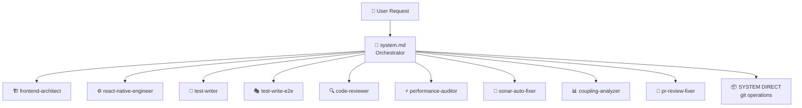
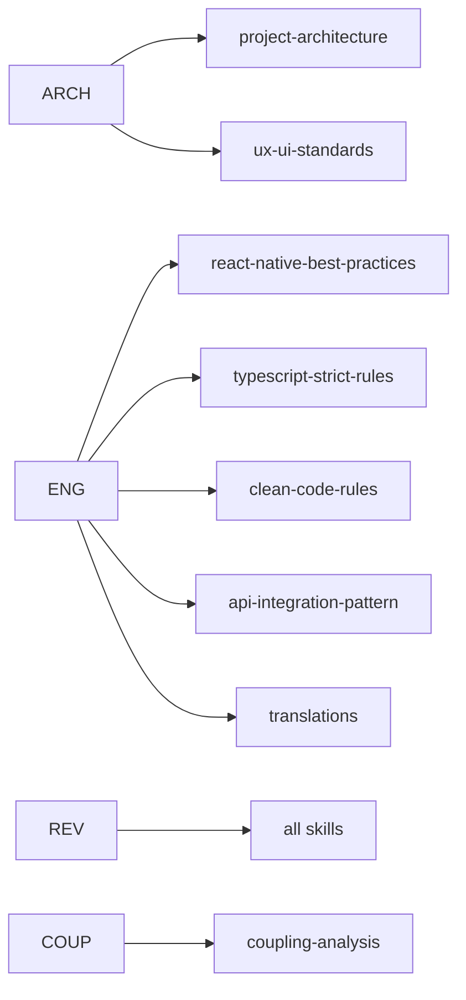
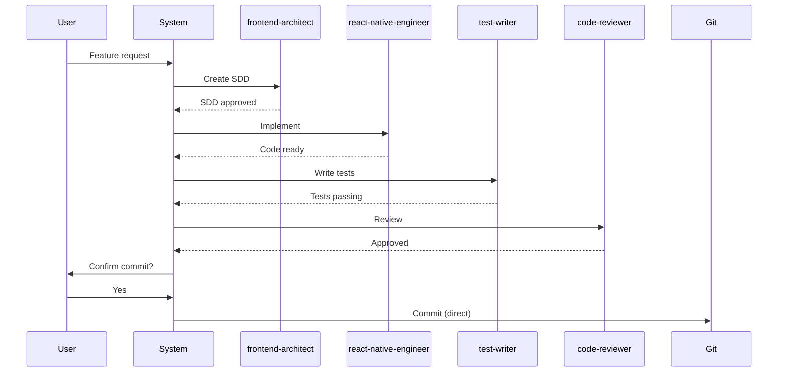

> **[PT]** Plano para criar um diagrama visual (Mermaid) do sistema de orquestração de agents, mostrando o fluxo completo desde o pedido do utilizador até à execução.

---

# SDD — Task #6: Agent Orchestration Diagram

**Status:** Done
**Priority:** Medium
**Agent:** `frontend-architect` (documentation)

---

## 🎯 Goal

Create a Mermaid diagram in `.ai/agents-orchestration.md` that visually represents the complete agent orchestration system — how `system.md` routes requests, which agents handle what, which skills they use, and how agents coordinate with each other.

---

## 📦 Scope

### New File
- `.ai/agents-orchestration.md` — Mermaid diagram + explanation

### Files to Reference
- `.ai/system.md` — orchestration routing matrix
- `.ai/agents/README.md` — agent descriptions
- `.ai/agents/*.md` — each agent's skills and triggers
- `.ai/skills/*.md` — skill definitions

---

## 🏗 Architecture Decisions

- Use **Mermaid `graph TB`** (top-to-bottom) for the main flow
- Use **Mermaid `flowchart LR`** (left-to-right) for the skill/rule breakdown
- Keep the diagram readable — group by domain (Architecture, Implementation, Testing, Quality, Git)
- Add a **legend** explaining node shapes (system, agent, skill, rule)

---

## 📋 Implementation Plan

### Diagram 1 — Request Routing Flow


### Diagram 2 — Skills per Agent


### Diagram 3 — Standard Feature Flow


### File Structure
```markdown
# Agent Orchestration

## Overview
[brief explanation]

## Request Routing Diagram
[Diagram 1]

## Skills Map
[Diagram 2]

## Standard Feature Flow
[Diagram 3]

## LLM Routing
[table: local vs remote per agent]
```

---

## ✅ Definition of Done

- [x] `.ai/agents-orchestration.md` created
- [x] All 9 active agents represented in the routing diagram
- [x] Skills mapped to each agent
- [x] Standard feature development flow shown as sequence diagram
- [x] LLM routing table (local vs remote) included
- [x] Diagrams render correctly in GitHub Markdown preview
