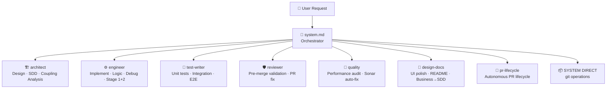
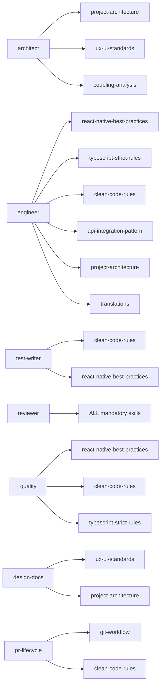
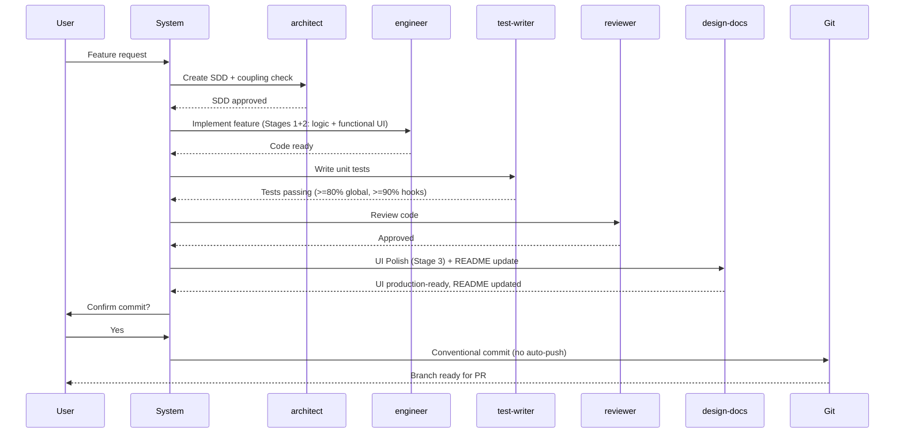
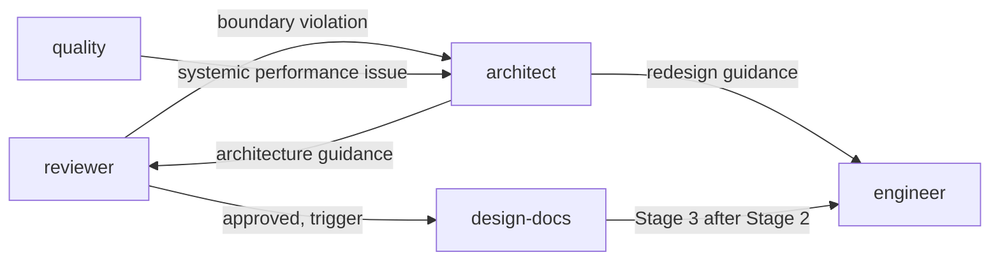

````markdown
> **[PT]** Diagrama visual (Mermaid) do sistema de orquestração de agents — mostra o fluxo completo desde o pedido do utilizador até à execução, com mapeamento de skills, LLM routing e sequência de uma feature completa. Versão 2.0: 14 agentes consolidados em 7.

---

# Agent Orchestration

## Overview

The FUSE AI system is a **constrained engineering environment** where 7 specialized agents handle different domains. All agents share the same architectural contracts, mandatory rules, and quality gates. The orchestrator (`system.md`) analyses every incoming request and routes it to the correct agent — or handles it directly for git operations.

---

## 1 — Request Routing Flow



---

## 2 — Skills Map



---

## 3 — Standard Feature Flow (3-Stage Pipeline)



---

## 4 — LLM Routing Strategy

| Agent | Model | Reason |
|---|---|---|
| `architect` | Claude Sonnet (always) | Architectural reasoning + coupling analysis across full codebase |
| `reviewer` | Claude Sonnet (always) | Pattern recognition across codebase, nuanced quality gates |
| `design-docs` (UI + Business) | Claude Sonnet (always) | Design system + architecture understanding |
| `design-docs` (Doc Update) | Claude Haiku | Low-complexity README writing — fast and cheap |
| `pr-lifecycle` | Claude Sonnet (always) | Multi-step autonomous PR decision making |
| `test-writer` | Local qwen2.5-coder:14b | Template-driven, deterministic (unit + E2E) |
| `engineer` | Conditional | Local for boilerplate; Claude for complex refactor/integration |
| `quality` | Conditional | Local for mechanical Sonar fixes; Claude for performance analysis |

**Strategy:** Save Claude tokens for reasoning-heavy work. Use local model for repetitive mechanical tasks. Escalate to Claude only when complexity signals are detected.

---

## 5 — Inter-Agent Coordination



---

## 6 — Request -> Agent Routing Matrix

| Request type | Agent | Mode / Command |
|---|---|---|
| New feature design / SDD | `architect` | default |
| Coupling / dependency analysis | `architect` | `/analyze-coupling` |
| Feature implementation (full stack) | `engineer` | default |
| Component / hook / bug fix | `engineer` | default |
| Unit / integration tests | `test-writer` | default |
| E2E tests from flow.md | `test-writer` | `/test-e2e` |
| Pre-merge code review | `reviewer` | default |
| Fix PR review comments | `reviewer` | `/fix-pr <PR_NUMBER>` |
| SonarQube issue auto-fix | `quality` | `/fix-sonar <PR_NUMBER>` |
| Performance audit | `quality` | `/audit-performance` |
| UI polish Stage 3 | `design-docs` | `/ui-polish` |
| README auto-update | `design-docs` | `/update-readme` (pre-push) |
| Business summary to SDD | `design-docs` | `/business-to-sdd` |
| Autonomous PR lifecycle | `pr-lifecycle` | `/pr-lifecycle <PR_NUMBER>` |
| commit / push / branch | **SYSTEM DIRECT** | git-workflow rules |
| Novel / unknown request | **CREATE NEW AGENT** | — |

---

## 7 — Mandatory Rules (All Agents)

Every agent enforces the following rules from `.ai/rules/`:

| Rule file | Enforcement |
|---|---|
| `folder-structure.md` | `screens/<domain>/<screen>/` layout |
| `mandatory-rules.md` | Strict TypeScript, no barrel imports, no inline styles |
| `naming-conventions.md` | kebab-case files, domain-intent naming |
| `git-workflow.md` | Conventional commits, no auto-push, Husky enforced |

**Hard constraints (all agents, no exceptions):**
- Never bypass agent delegation
- Never auto-commit without explicit user confirmation
- Never auto-push
- Never commit `ios/` or `android/` (Expo prebuild artifacts)
- Never commit secrets (`.env`, certificates, API keys)
- Never use barrel imports
- Never hardcode UI values (use theme tokens)
- Never use `ScrollView` for dynamic lists (use `FlashList`)
- Never skip hook tests (minimum 90% coverage)

---

## 8 — Metrics & Observability

All agents log to `.ai/router/`:

| File | Contents |
|---|---|
| `token-usage.md` | Token consumption table — updated automatically on every `git push` |
| `token-usage.csv` | Raw token log (Claude + Ollama) — source for the MD table |
| `sonar-fixes.csv` | Auto-fix history & success rate |
| `pr-lifecycle.csv` | PR processing metrics |
| `orchestration.csv` | Agent invocation patterns |

**Token tracking flow:** `log-claude-tokens.sh` / `log-ollama-tokens.sh` -> `token-usage.csv` -> `generate-token-md.sh` (runs on pre-push) -> `token-usage.md` committed automatically.

````