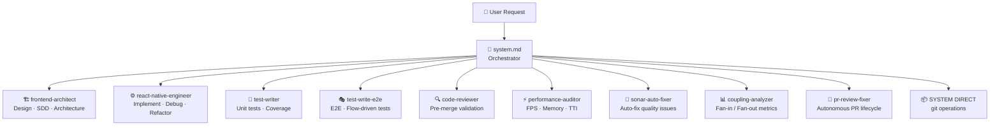
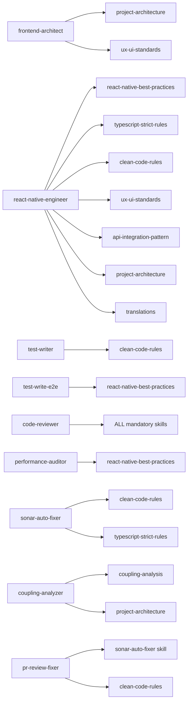
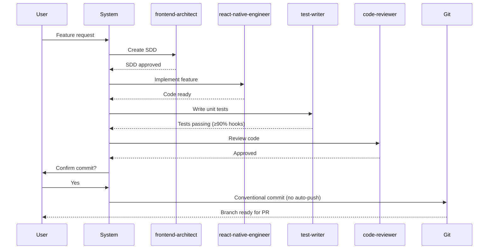
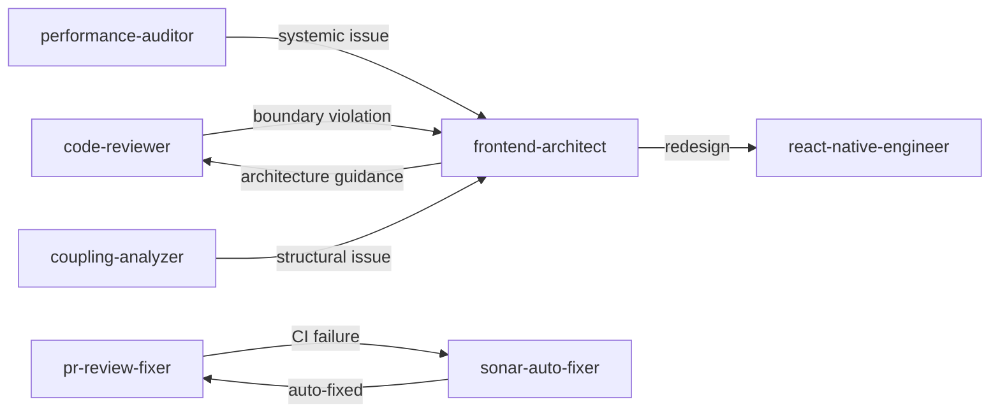

> **[PT]** Diagrama visual (Mermaid) do sistema de orquestração de agents — mostra o fluxo completo desde o pedido do utilizador até à execução, com mapeamento de skills, LLM routing e sequência de uma feature completa.

---

# Agent Orchestration

## Overview

The FUSE AI system is a **constrained engineering environment** where specialized agents handle different domains. All agents share the same architectural contracts, mandatory rules, and quality gates. The orchestrator (`system.md`) analyses every incoming request and routes it to the correct agent — or handles it directly for git operations.

---

## 1 — Request Routing Flow

---

## 2 — Skills Map

---

## 3 — Standard Feature Flow

---

## 4 — LLM Routing Strategy

| Agent | Model | Reason |
|---|---|---|
| `frontend-architect` | ☁️ Claude Sonnet (always) | High-value architectural reasoning |
| `code-reviewer` | ☁️ Claude Sonnet (always) | Pattern recognition across full codebase |
| `performance-auditor` | ☁️ Claude Sonnet (always) | Complex profiling & root cause analysis |
| `coupling-analyzer` | ☁️ Claude Sonnet (always) | Holistic codebase structure analysis |
| `pr-review-fixer` | ☁️ Claude Sonnet (always) | Multi-step autonomous decision making |
| `test-writer` | 🏠 Local `qwen2.5-coder:14b` | Template-driven, deterministic |
| `test-write-e2e` | 🏠 Local `qwen2.5-coder:14b` | `flow.md` → test code mapping |
| `react-native-engineer` | 🔀 Conditional | Local for boilerplate; Claude for complex refactor |
| `sonar-auto-fixer` | 🔀 Conditional | Local for mechanical fixes; Claude for architecture |

**Strategy:** Save Claude tokens for reasoning-heavy work. Use local model for repetitive mechanical tasks. Escalate to Claude only when complexity signals are detected.

---

## 5 — Inter-Agent Coordination

---

## 6 — Request → Agent Routing Matrix

| Request type | Agent | Skills loaded |
|---|---|---|
| New feature design / SDD | `frontend-architect` | project-architecture, ux-ui-standards |
| Feature implementation | `react-native-engineer` | all |
| Component / hook creation | `react-native-engineer` | react-native-best-practices, clean-code-rules |
| API integration | `react-native-engineer` | api-integration-pattern |
| Bug fix | `react-native-engineer` | relevant skills |
| Unit tests | `test-writer` | clean-code-rules |
| E2E tests | `test-write-e2e` | react-native-best-practices |
| Pre-merge code review | `code-reviewer` | ALL mandatory rules |
| Performance issues | `performance-auditor` | react-native-best-practices |
| SonarQube issues | `sonar-auto-fixer` | clean-code-rules, typescript-strict-rules |
| Coupling analysis | `coupling-analyzer` | coupling-analysis, project-architecture |
| Autonomous PR lifecycle | `pr-review-fixer` | sonar-auto-fixer, clean-code-rules |
| `commit` / `push` / `pr` | **SYSTEM DIRECT** | git-workflow rules |
| Novel / unknown request | **CREATE NEW AGENT** | — |

---

## 7 — Mandatory Rules (All Agents)

Every agent enforces the following rules from `.ai/rules/`:

| Rule file | Enforcement |
|---|---|
| `folder-structure.md` | `screens/<domain>/<screen>/` layout |
| `mandatory-rules.md` | Strict TypeScript, no barrel imports, no inline styles |
| `naming-conventions.md` | kebab-case files, domain-intent naming |
| `git-workflow.md` | Conventional commits, no auto-push, Husky enforced |

**Hard constraints (all agents, no exceptions):**
- Never bypass agent delegation
- Never auto-commit without explicit user confirmation
- Never auto-push
- Never commit `ios/` or `android/` (Expo prebuild artifacts)
- Never commit secrets (`.env`, certificates, API keys)
- Never use barrel imports
- Never hardcode UI values (use theme tokens)
- Never use `ScrollView` for dynamic lists (use `FlashList`)
- Never skip hook tests (minimum 90% coverage)

---

## 8 — Metrics & Observability

All agents log to `.ai/router/`:

| File | Contents |
|---|---|
| `token-usage.csv` | Daily token consumption (Claude + Ollama) |
| `sonar-fixes.csv` | Auto-fix history & success rate |
| `pr-lifecycle.csv` | PR processing metrics |
| `orchestration.csv` | Agent invocation patterns |
| `coupling-history.csv` | Coupling metrics trend over time |

Run `.ai/router/update-token-totals.sh` for a daily summary.
