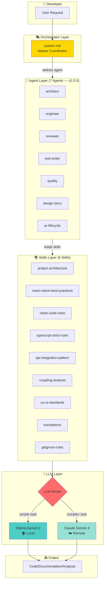
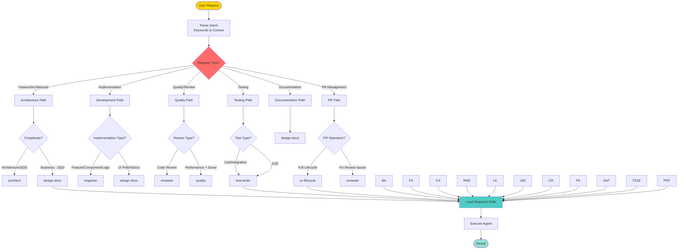
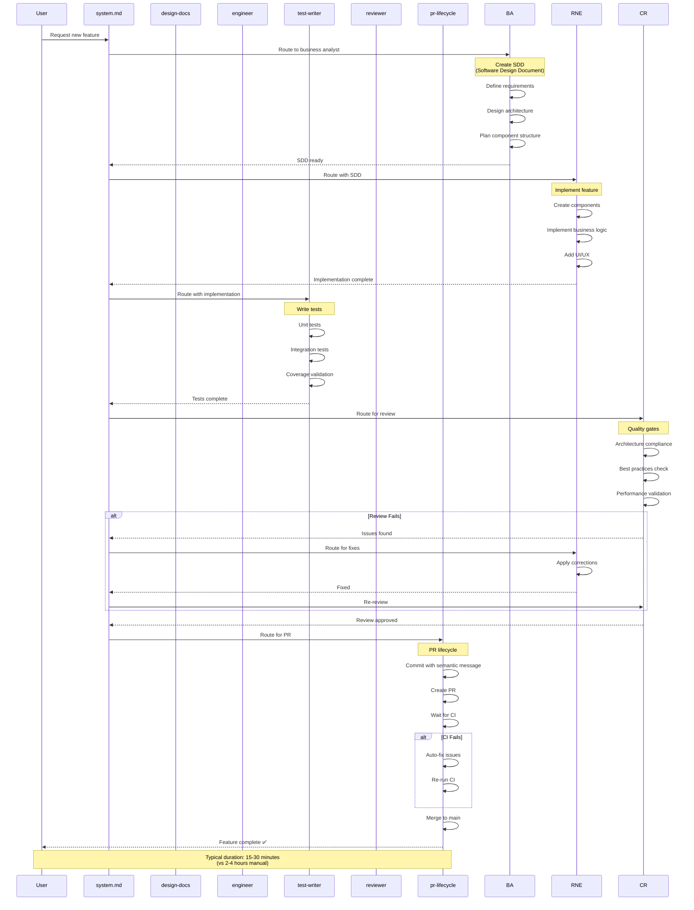
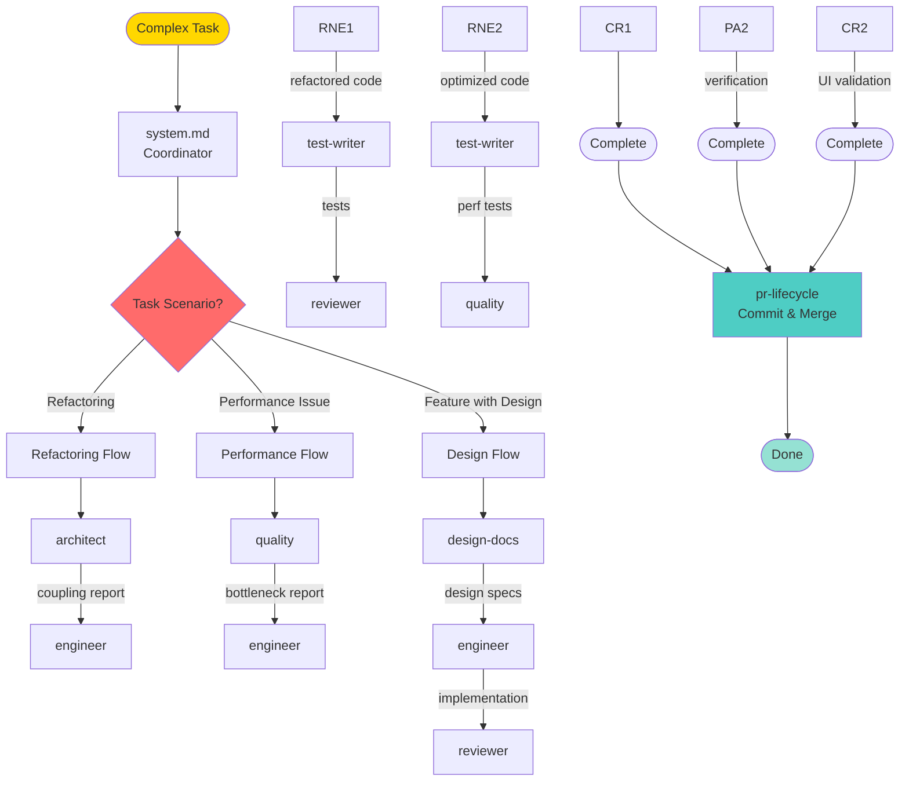
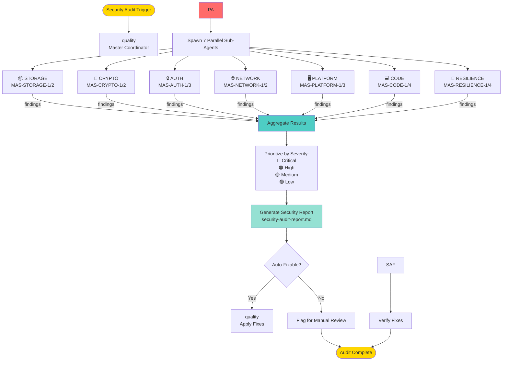
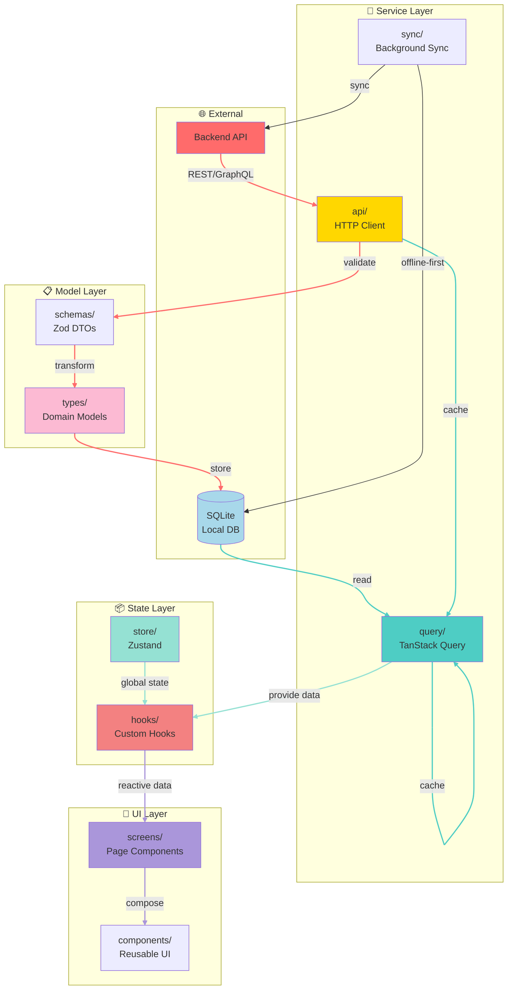
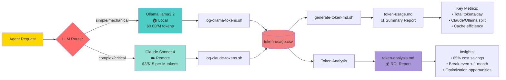
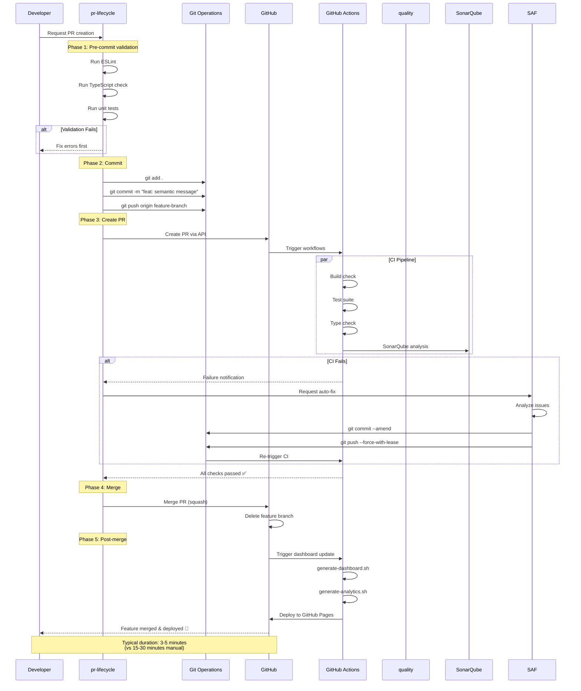

# 🏗️ FUSE AI System Architecture

> **[PT]** Documentação consolidada da arquitetura completa do sistema FUSE AI, incluindo orquestração de agents, routing de LLMs, fluxos de dados, e integração CI/CD. Todos os diagramas em Mermaid para versionamento e renderização no GitHub.

---

## 🎯 Purpose

This document provides a comprehensive visual map of the FUSE AI orchestration system architecture. It consolidates previously scattered diagrams into a single source of truth, covering:

- System layers and component relationships
- Request routing and LLM decision logic
- Agent-to-skills mappings
- Standard workflow sequences
- Token economics and cost tracking
- CI/CD pipeline integration

All diagrams use Mermaid syntax for version control and GitHub rendering.

---

## 📊 Diagram Index

1. [System Overview](#1-system-overview) — High-level layers
2. [Request Routing Flow](#2-request-routing-flow) — How system.md orchestrates
3. [LLM Router Decision Tree](#3-llm-router-decision-tree) — Local vs Cloud logic
4. [Agent-Skills Map](#4-agent-skills-map) — Which skills each agent loads
5. [Standard Feature Flow](#5-standard-feature-flow) — SDD → Implementation → Tests → Review
6. [Inter-Agent Coordination](#6-inter-agent-coordination) — Multi-agent workflows
7. [Security Audit Pipeline](#7-security-audit-pipeline) — OWASP MAS parallel execution
8. [Data Flow Architecture](#8-data-flow-architecture) — Model → Service → Query → Hook → Screen
9. [Token Economics Flow](#9-token-economics-flow) — Cost tracking and analysis
10. [CI/CD Integration](#10-cicd-integration) — PR lifecycle automation

---

## 1. System Overview

High-level view of the FUSE AI orchestration layers.



---

## 2. Request Routing Flow

How `system.md` analyzes requests and routes to appropriate agents.



---

## 3. LLM Router Decision Tree

Complexity-based routing logic: Local (Ollama) vs Cloud (Claude).

```mermaid
flowchart TD
    Request[Agent Request] --> Analyze[Analyze Complexity Signals]

    Analyze --> CheckKeywords{Contains Complexity<br/>Keywords?}

    CheckKeywords -->|Yes| ComplexSignals[Detected Signals:<br/>• refactor<br/>• debug<br/>• architecture<br/>• integration<br/>• performance<br/>• complex<br/>• analyze]
    CheckKeywords -->|No| CheckSize{Token Count<br/>> 5000?}

    ComplexSignals --> RouteCloud[Route to Claude]

    CheckSize -->|Yes| RouteCloud
    CheckSize -->|No| CheckAgent{Agent Always<br/>Remote?}

    CheckAgent -->|Yes| ForceCloud[Force Claude:<br/>• architect<br/>• reviewer<br/>• quality (perf mode)<br/>• pr-lifecycle<br/>• design-docs (UI/BA)]
    CheckAgent -->|No| CheckMechanical{Mechanical<br/>Task?}

    ForceCloud --> RouteCloud

    CheckMechanical -->|Yes| MechanicalTasks[Mechanical Tasks:<br/>• SonarQube fixes<br/>• Formatting<br/>• Type corrections<br/>• Import sorting]
    CheckMechanical -->|No| RouteLocal[Route to Ollama]

    MechanicalTasks --> RouteLocal

    RouteCloud --> LogCloudTokens[Log to token-usage.csv<br/>Provider: claude]
    RouteLocal --> LogOllamaTokens[Log to token-usage.csv<br/>Provider: ollama]

    LogCloudTokens --> Execute[Execute Request]
    LogOllamaTokens --> Execute

    Execute --> End([Return Result])

    style Request fill:#FFD700
    style CheckKeywords fill:#FF6B6B
    style RouteCloud fill:#95E1D3
    style RouteLocal fill:#4ECDC4
    style End fill:#FFD700
```

---

## 4. Agent-Skills Map

Matrix showing which skills each agent loads into context.

```mermaid
graph TD
    subgraph Agents["🤖 Agents"]
        AR[architect]
        ENG[engineer]
        REV[reviewer]
        TW[test-writer]
        QL[quality]
        PRL[pr-lifecycle]
        DD[design-docs]
    end

    subgraph CoreSkills["📚 Core Skills"]
        ProjArch[project-architecture<br/>v1.0.0]
        RNBest[react-native-best-practices<br/>v1.0.0]
        CleanCode[clean-code-rules<br/>v1.0.0]
        TSRules[typescript-strict-rules<br/>v1.0.0]
    end

    subgraph SpecializedSkills["🎯 Specialized Skills"]
        APIInt[api-integration-pattern<br/>v1.0.0]
        Coupling[coupling-analysis<br/>v1.0.0]
        UXUI[ux-ui-standards<br/>v1.0.0]
        Trans[translations<br/>v1.0.0]
        GitIgnore[gitignore-rules<br/>v1.0.0]
    end

    FA --> ProjArch
    FA --> CleanCode
    FA --> TSRules

    RNE --> ProjArch
    RNE --> RNBest
    RNE --> CleanCode
    RNE --> TSRules
    RNE --> APIInt

    CR --> ProjArch
    CR --> RNBest
    CR --> CleanCode
    CR --> TSRules

    TW --> ProjArch
    TW --> CleanCode
    TW --> TSRules

    TE2E --> ProjArch
    TE2E --> RNBest

    PA --> ProjArch
    PA --> RNBest
    PA --> CleanCode

    SAF --> CleanCode
    SAF --> TSRules

    CA --> ProjArch
    CA --> Coupling

    PRL --> ProjArch
    PRL --> GitIgnore

    PRF --> ProjArch
    PRF --> CleanCode
    PRF --> TSRules

    BA --> ProjArch
    BA --> APIInt

    DD --> CleanCode

    LE --> ProjArch
    LE --> CleanCode
    LE --> TSRules

    UID --> ProjArch
    UID --> RNBest
    UID --> UXUI
    UID --> Trans

    style ProjArch fill:#FFD700
    style RNBest fill:#4ECDC4
    style CleanCode fill:#95E1D3
    style TSRules fill:#FF6B6B
```



---

## 5. Standard Feature Flow

Complete workflow from SDD to production-ready code.



---

## 6. Inter-Agent Coordination

Multi-agent workflows for complex tasks.



---

## 7. Security Audit Pipeline

OWASP Mobile Application Security (MAS) parallel execution.



---

## 8. Data Flow Architecture

React Native layered architecture with strict boundaries.



---

## 9. Token Economics Flow

Cost tracking and router optimization.



**Token Distribution (16-23 March 2026):**

| Provider  |   Input |    Output |  Cache Read |     Total | Cost (USD) |
| --------- | ------: | --------: | ----------: | --------: | ---------: |
| Claude    | 288,371 | 1,886,757 | 329,113,032 | 2,175,128 |    ~$29.16 |
| Ollama    | 191,800 |    86,200 |           0 |   278,000 |      $0.00 |
| **Split** | **35%** |   **65%** |       **—** |     **—** |      **—** |

**ROI:** ~35% savings vs Claude-only setup ($44.90)

---

## 10. CI/CD Integration

PR lifecycle automation with git operations.



---

## 🗺️ Quick Reference Guide

### Component Locations

| Component             | Location                                   | Purpose                           |
| --------------------- | ------------------------------------------ | --------------------------------- |
| **Orchestrator**      | `.ai/system.md`                            | Master coordinator, routing logic |
| **Agents**            | `.ai/agents/*.md`                          | 14 specialized agents             |
| **Skills**            | `.ai/skills/*.md`                          | 9 reusable knowledge modules      |
| **Router**            | `.ai/router/router.md`                     | LLM complexity routing            |
| **Token Tracking**    | `.ai/router/token-usage.csv`               | Raw token logs                    |
| **Token Analysis**    | `.ai/router/token-analysis.md`             | Economics & ROI                   |
| **Architecture**      | `.ai/docs/architecture.md`                 | This document                     |
| **Quick Reference**   | `.ai/docs/orchestrator-quick-reference.md` | Fast lookup guide                 |
| **Project Structure** | `.ai/docs/project-structure-snapshot.md`   | Codebase map                      |
| **Agent Changelog**   | `.ai/agents/CHANGELOG.md`                  | Version history                   |

### Symbol Legend

| Symbol | Meaning      | Usage                          |
| ------ | ------------ | ------------------------------ |
| 🎭     | Orchestrator | System coordinator             |
| 🤖     | Agent        | Specialized AI worker          |
| 📚     | Skill        | Reusable knowledge module      |
| 🧠     | LLM          | Language model (Ollama/Claude) |
| 🔄     | Flow         | Process sequence               |
| 📊     | Data         | Information/metrics            |
| 🔗     | Integration  | System connection              |
| ⚡     | Performance  | Speed/optimization focus       |
| 🔒     | Security     | Safety/validation              |
| ✅     | Success      | Completed/approved             |

---

## 📖 Related Documentation

- **[Orchestrator Quick Reference](orchestrator-quick-reference.md)** — Fast decision tree for routing
- **[Project Structure Snapshot](project-structure-snapshot.md)** — Detailed codebase map
- **[Agent Changelog](../agents/CHANGELOG.md)** — Version tracking for agents
- **[Token Analysis](../router/token-analysis.md)** — Economic analysis and ROI
- **[Router Logic](../router/router.md)** — LLM complexity routing details
- **[System Orchestrator](../system.md)** — Master coordinator implementation

---

## 🔄 Document Maintenance

**Version:** 1.0.0  
**Created:** 2026-03-23  
**Last Updated:** 2026-03-23  
**Author:** Eugénio Silva

**Update Frequency:** This document should be updated when:

- New agents are added or removed
- Agent responsibilities change significantly
- Skills are added, removed, or restructured
- Routing logic is modified
- New CI/CD integrations are added

**Validation:** After updates, ensure all Mermaid diagrams render correctly on GitHub by previewing in a Mermaid-compatible editor.

---

**End of Architecture Documentation**
