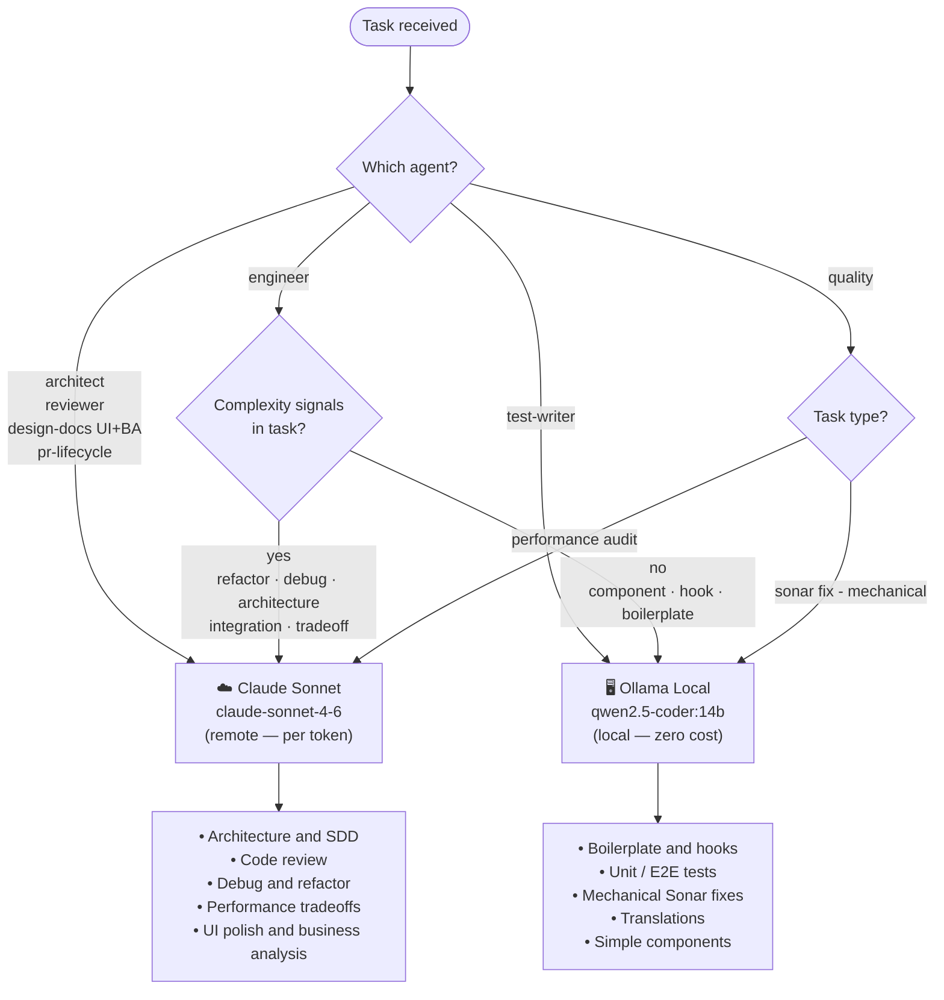

> **[PT]** Define a estratégia de roteamento entre modelo local (Ollama) e modelo remoto (Claude), detalhando critérios de decisão por agente e rastreamento de uso de tokens.

---

# LLM Router

> In a development flow, the LLM router decides whether to send a task to a local model (Ollama qwen2.5-coder:14b) or a remote model (Claude Sonnet). Simple tasks are directed to the local model for speed and efficiency, while complex tasks are sent to the remote model which has more processing power and advanced capabilities. This system helps optimize the workflow, balancing speed and available resources.
>
> _— generated by `qwen2.5-coder:14b` (local)_

---

## Why Two Models?

The central goal is **token savings without quality loss**.

Claude (remote) tokens have a per-use cost and network latency. Most development tasks — boilerplate generation, test creation, string translations — are **mechanical and deterministic**: given the right context, any model capable of following a template produces the correct result.

Reserving Claude for tasks that require **cross-cutting reasoning**, tradeoff analysis, and broad codebase context is what ensures quality where it matters, without wasting tokens on repetitive work.

### General Rule

```
Se a task pode ser resolvida seguindo um template → Local (qwen2.5-coder:14b)
Se a task exige julgamento, raciocínio ou contexto amplo → Remoto (claude-sonnet-4-6)
```

---

## Models

| Type   | Model               | Cost      | When to use                                        |
| ------ | ------------------- | --------- | -------------------------------------------------- |
| Local  | `qwen2.5-coder:14b` | Zero      | Mechanical tasks, boilerplate, tests, translations |
| Remote | `claude-sonnet-4-6` | Per token | Architecture, review, debug, refactor, tradeoffs   |

---

## Routing by Agent

### Always Remote (Claude)

These agents **never use the local model** because the work requires reasoning about the entire codebase, detection of subtle pattern violations, and cross-feature impact analysis.

| Agent                               | Reason                                                                             |
| ----------------------------------- | ---------------------------------------------------------------------------------- |
| `architect`                         | SDD, coupling analysis, cross-cutting design, architectural tradeoffs              |
| `reviewer`                          | Quality gates, architectural violation detection, reasoning about codebase context |
| `design-docs` (UI + Business modes) | Design system understanding, SDD writing, product intent interpretation            |
| `pr-lifecycle`                      | Multi-step autonomous PR management — requires cross-cutting reasoning             |

> **Economy:** these agents are invoked infrequently (once per feature or per review cycle). The cost per invocation is justified by the impact of the decisions.

---

### Always Local (qwen2.5-coder:14b)

These agents **always use the local model** because the output is fully deterministic.

| Agent                           | Reason                                                                                      |
| ------------------------------- | ------------------------------------------------------------------------------------------- |
| `test-writer`                   | Unit/integration + E2E test generation — template-driven, deterministic, no judgment needed |
| `design-docs` (Doc Update mode) | README writing is low-complexity — uses Claude Haiku (not Sonnet, not local)                |

> **Economy:** `test-writer` is the most frequently invoked agent. Running 100% locally eliminates token costs for the bulk of request volume.

---

### Dynamic Routing

**`engineer`** — most versatile agent (features, components, hooks, debug). Local by default, escalating to Claude only when complexity signals are present.

**`quality`** — local by default for mechanical Sonar fixes; Claude for performance analysis and architectural refactors.

#### Signals that force Claude (remote)

```
refactor    debug       architecture    integration
migration   tradeoff    performance     design
```

#### No signals → Local by default

```
create component    add hook          write test
add translation     rename            extract
move file           generate boilerplate
```

---

## Diagram



---

## Economy Estimate

In a typical feature cycle:

| Step                     | Agent         | Model  | Frequency        |
| ------------------------ | ------------- | ------ | ---------------- |
| Structure definition     | `architect`   | Claude | 1x per feature   |
| Implementation (simple)  | `engineer`    | Local  | N×               |
| Implementation (complex) | `engineer`    | Claude | 0–2x per feature |
| Test generation          | `test-writer` | Local  | N×               |
| Code review              | `reviewer`    | Claude | 1x per feature   |
| UI polish                | `design-docs` | Claude | 1x per feature   |
| README update            | `design-docs` | Haiku  | 1x per push      |
| Sonar fix (mechanical)   | `quality`     | Local  | On-demand        |
| Performance audit        | `quality`     | Claude | On-demand        |

> The bulk of volume (simple implementation + tests) goes to the local model. Claude is used selectively for high-impact decisions.

---

## Implementation Reference

Environment variables:

```
OLLAMA_HOST=http://localhost:11434   # default — Ollama local
ANTHROPIC_API_KEY=...               # required for Claude (remote)
```

---

## Token Usage Tracking

The project automatically tracks token usage in `token-usage.csv` for cost and efficiency analysis.

### Logging Scripts

- **`log-claude-tokens.sh`** — logs Claude (remote) tokens via Stop hook
- **`log-ollama-tokens.sh`** — logs Ollama (local) tokens via PostToolUse hook
- **`update-token-totals.sh`** — calculates and displays daily totals on pre-push

### CSV Format

```csv
date,session_id,provider,model,input_tokens,output_tokens,cache_read,total_tokens
2026-03-21 10:00:00,abc123,claude,claude-sonnet-4-6,1500,800,300,2600
2026-03-21 10:15:00,abc123,ollama,qwen2.5-coder:14b,5000,3000,0,8000
```

### Pre-push Display

When pushing, the hook automatically displays the day's token summary:

```
📊 Token Usage for 2026-03-21
============================================================

CLAUDE:
  Input:      1,500 tokens
  Output:     800 tokens
  Cache Read: 300 tokens
  Total:      2,600 tokens

OLLAMA:
  Input:      5,000 tokens
  Output:     3,000 tokens
  Total:      8,000 tokens

────────────────────────────────────────────────────────────
OVERALL TOTAL: 10,600 tokens
  • Input:  6,500
  • Output: 3,800
  • Cache:  300
============================================================
```

This enables monitoring of the real savings achieved by local/remote routing.

---
