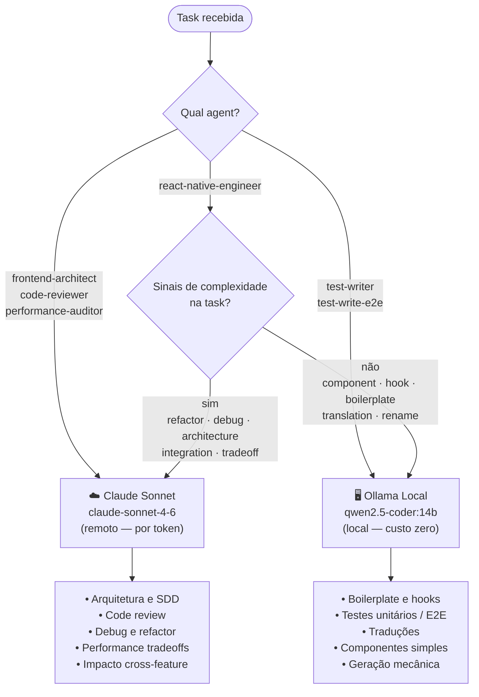

# LLM Router

> Em um fluxo de desenvolvimento, o roteador LLM decide se envia uma tarefa para um modelo local (Ollama qwen2.5-coder:14b) ou para um modelo remoto (Claude Sonnet). Tarefas simples são direcionadas ao modelo local para maior velocidade e eficiência, enquanto tarefas complexas são enviadas ao modelo remoto que possui mais poder de processamento e capacidades avançadas. Esse sistema ajuda a otimizar o fluxo de trabalho, equilibrando rapidez e recursos disponíveis.
>
> _— gerado por `qwen2.5-coder:14b` (local)_

---

## Por que dois modelos?

O objetivo central é **economia de tokens sem perda de qualidade**.

Tokens Claude (remoto) têm custo por uso e latência de rede. A maioria das tarefas de desenvolvimento — geração de boilerplate, criação de testes, traduções de strings — é **mecânica e determinística**: dado o contexto certo, qualquer modelo capaz de seguir um template produz o resultado correto.

Reservar Claude para tarefas que exigem **raciocínio cross-cutting**, análise de tradeoffs e contexto amplo do codebase é o que garante qualidade onde ela importa, sem gastar tokens desnecessários no trabalho repetitivo.

### Regra geral

```
Se a task pode ser resolvida seguindo um template → Local (qwen2.5-coder:14b)
Se a task exige julgamento, raciocínio ou contexto amplo → Remoto (claude-sonnet-4-6)
```

---

## Modelos

| Tipo   | Modelo              | Custo     | Quando usar                                     |
| ------ | ------------------- | --------- | ----------------------------------------------- |
| Local  | `qwen2.5-coder:14b` | Zero      | Tasks mecânicas, boilerplate, testes, traduções |
| Remoto | `claude-sonnet-4-6` | Por token | Arquitetura, review, debug, refactor, tradeoffs |

---

## Routing por Agent

### Sempre Remoto (Claude)

Estes agents **nunca usam modelo local** porque o trabalho exige raciocínio sobre o codebase inteiro, detecção de violações sutis de padrão, e análise de impacto cross-feature — capacidades que o modelo local não suporta de forma confiável.

| Agent                 | Motivo                                                                                    |
| --------------------- | ----------------------------------------------------------------------------------------- |
| `frontend-architect`  | SDD, design cross-cutting, análise de dependências entre camadas, decisões com tradeoffs  |
| `code-reviewer`       | Quality gates, detecção de violações arquiteturais, raciocínio sobre contexto do codebase |
| `performance-auditor` | Profiling, análise de gargalos, tradeoffs de otimização com dados reais                   |

> **Economia:** estes agents são invocados com baixa frequência (uma vez por feature ou por review cycle). O custo por invocação é justificado pelo impacto das decisões.

---

### Sempre Local (qwen2.5-coder:14b)

Estes agents **sempre usam modelo local** porque o output é totalmente determinístico: dado o input correto (hook, service, flow.md), o mapeamento para o código de teste segue templates fixos sem necessidade de julgamento.

| Agent            | Motivo                                                                                            |
| ---------------- | ------------------------------------------------------------------------------------------------- |
| `test-writer`    | Geração de unit/integration tests — template-driven, determinístico, sem interpretação de produto |
| `test-write-e2e` | Tradução de `flow.md` para E2E tests — mapeamento 1:1 (Given/When/Then → setup/action/assertion)  |

> **Economia:** estes agents são os mais invocados no ciclo de desenvolvimento. Rodar 100% local elimina custo de token para a maior parte do volume de requisições.

---

### Dinâmico (`react-native-engineer`)

O engineer é o agent mais versátil — implementa features, escreve componentes, hooks, adapters e lida com debug. A escolha do modelo depende da natureza da task.

**Estratégia:** local por padrão, escalando para Claude apenas quando sinais de complexidade estão presentes.

#### Sinais que forçam Claude (remoto)

Qualquer um destes termos na descrição da task:

```
refactor    debug       architecture    integration
migration   tradeoff    performance     design
```

#### Sem sinais → Local por padrão

```
create component    add hook          write test
add translation     rename            extract
move file           add export        generate boilerplate
```

> **Economia:** a maioria das tasks diárias do engineer (criar telas, adicionar hooks, escrever boilerplate) não contém sinais de complexidade. Rodar local para esses casos reduz significativamente o consumo de tokens ao longo de uma sprint.

---

## Diagrama



---

## Estimativa de economia

Em um ciclo típico de feature:

| Etapa                    | Agent                   | Modelo | Frequência       |
| ------------------------ | ----------------------- | ------ | ---------------- |
| Definição de estrutura   | `frontend-architect`    | Claude | 1x por feature   |
| Implementação (simples)  | `react-native-engineer` | Local  | N×               |
| Implementação (complexa) | `react-native-engineer` | Claude | 0–2x por feature |
| Geração de testes        | `test-writer`           | Local  | N×               |
| Geração de E2E           | `test-write-e2e`        | Local  | 1–2x por feature |
| Code review              | `code-reviewer`         | Claude | 1x por feature   |

> O grosso do volume (implementação simples + testes) vai para o modelo local. Claude é usado pontualmente em decisões de alto impacto.

---

## Referência de implementação

Variáveis de ambiente:

```
OLLAMA_HOST=http://localhost:11434   # default — Ollama local
ANTHROPIC_API_KEY=...               # obrigatório para Claude (remoto)
```

---

## Token Usage Tracking

O projeto rastreia automaticamente o uso de tokens em `token-usage.csv` para análise de custo e eficiência.

### Scripts de logging

- **`log-claude-tokens.sh`** — registra tokens do Claude (remoto) via hook Stop
- **`log-ollama-tokens.sh`** — registra tokens do Ollama (local) via hook PostToolUse
- **`update-token-totals.sh`** — calcula e exibe totais diários no pre-push

### Formato CSV

```csv
date,session_id,provider,model,input_tokens,output_tokens,cache_read,total_tokens
2026-03-21 10:00:00,abc123,claude,claude-sonnet-4-6,1500,800,300,2600
2026-03-21 10:15:00,abc123,ollama,qwen2.5-coder:14b,5000,3000,0,8000
```

### Visualização no pre-push

Ao fazer push, o hook exibe automaticamente o resumo de tokens do dia:

```
📊 Token Usage for 2026-03-21
============================================================

CLAUDE:
  Input:      1,500 tokens
  Output:     800 tokens
  Cache Read: 300 tokens
  Total:      2,600 tokens

OLLAMA:
  Input:      5,000 tokens
  Output:     3,000 tokens
  Total:      8,000 tokens

────────────────────────────────────────────────────────────
OVERALL TOTAL: 10,600 tokens
  • Input:  6,500
  • Output: 3,800
  • Cache:  300
============================================================
```

Isso permite monitorar a economia real alcançada pelo routing local/remoto.

---
